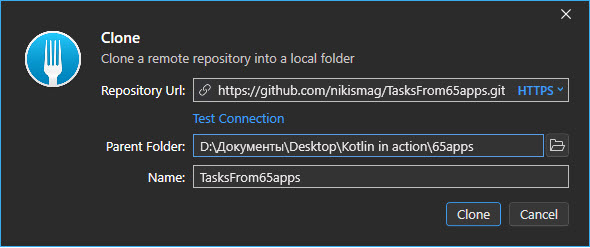
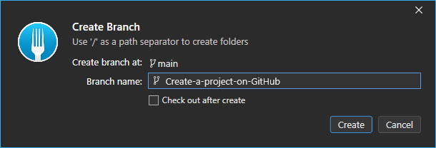

# Учебный проект в школе Android разработки 65apps

### Домашнее зание №1. Создание проекта на GitHub.

1. создаём репозиторий на GitHub
2. спомощью Git-Client(a) Fork клонируем репозиторий на свой PC

3. создаём новую ветку

4. добавляем в новую ветку пустой Activity и изменения в Readme
5. коммитим

![commit] (img/commit.jpg)

6. пушим на GitHub

![push] (img/push.jpg)

7. разрешаем доступ соавторам
