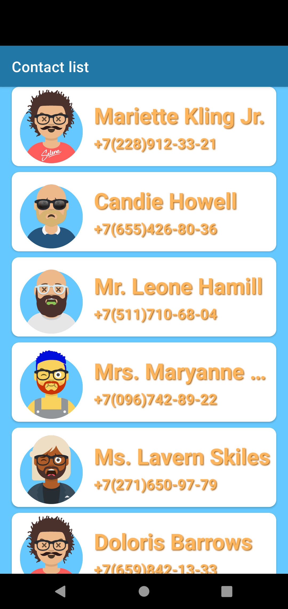
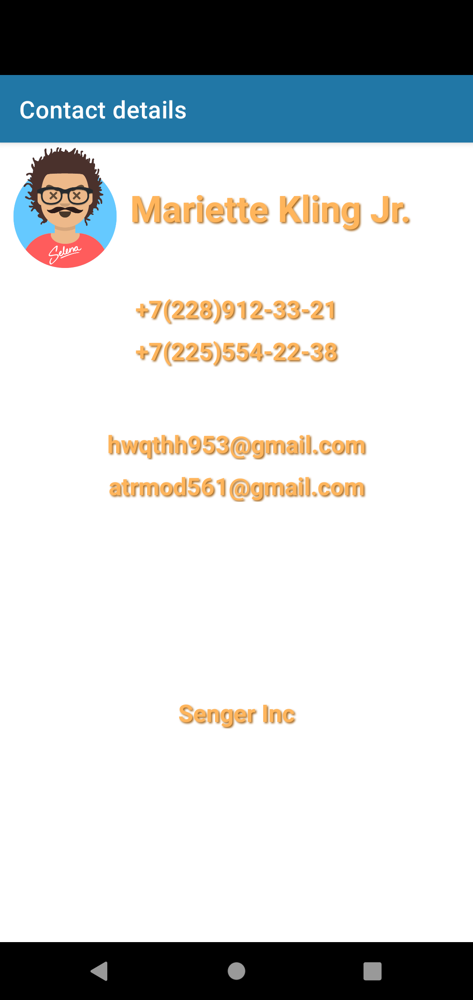
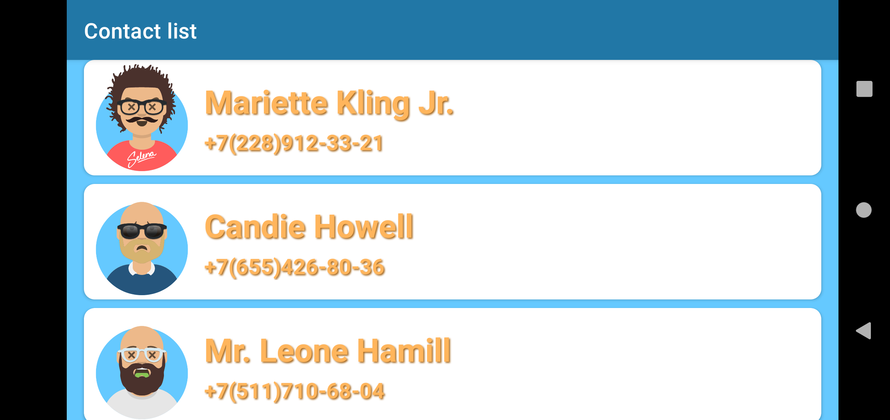
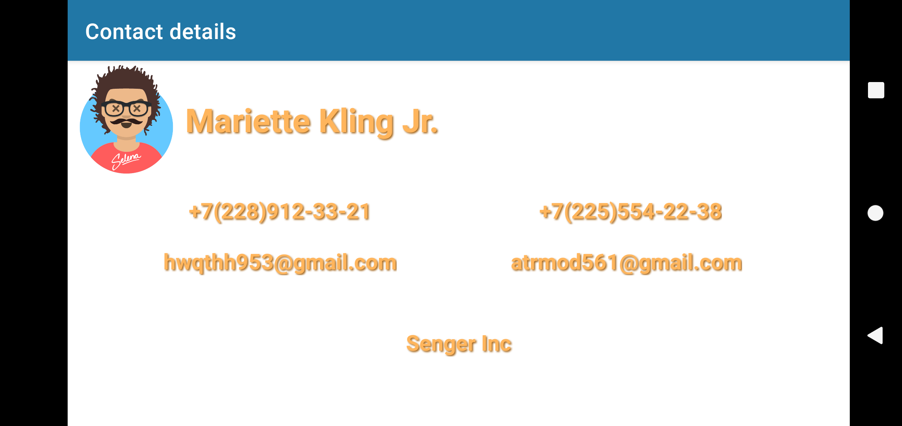
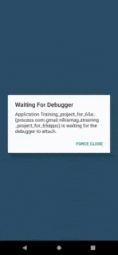

# Учебный проект в школе Android разработки 65apps

### ОПИСАНЕ ПРОЕКТА
________________
Разрабатывается приложение под Android на языке Kotlin

Данный проект является результатом выполнения домашнего задания в школе Android разработки 65apps

**Разработчик:** Смагин Никита (nikismag@gmail.com)

**Используемые программы:** Android Studio, git-client Fork

**Телефон для тестирования:** Virtual Device Pixel 4

### СОСТОЯНИЕ ПРОЕКТА (в разработке)
________________
На данный момент прилождение имеет два экрана:

* первый со списком пользователей

* второй с информмацией о пользователях

Пользователь может выбрать нужный аккаунт из списка и перейти к более подробной информации и так же вернуться назад

### вертикальное исполнение

### горизонтальное исполнение

### демонстрация работы приложения

